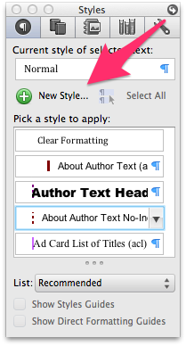
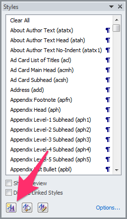
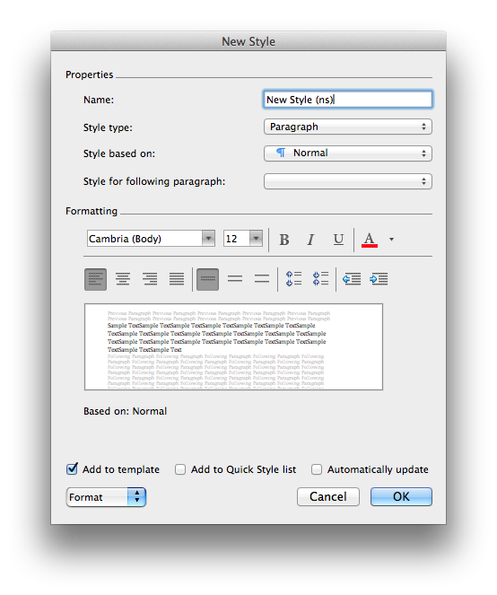

# Naming conventions
* Each style name must end with a short style code in parentheses. 
* Paragraph styles are first-letter (of each word) caps, and character styles are all lowercase. 
* Paragraph styles begin with the word indicating their section of the book.
* Character styles all begin with the word "span".

Duplicate any changes to macmillan.dotm in macmillan_NoColor.dotm.

# Creating new styles
Make sure you have the most up-to-date master branch of the word-template repo. (We have some info on Project Development with GitHub too.)

1.Start a new feature branch.
1. Open Word, then use File > Open to open the file macmillan.dotm. (Do NOT click on the file to open it; this opens a new document based on the template, not the template itself.)
1. Open the Styles Pane and click the New Style button.

### On a Mac

### On a PC

1. Create your style in the New Style window that opens.

	1. Add a new name, following the naming conventions for the Macmillan template: Paragraph styles are first-letter caps and first word must be the book section (e.g., Titlepage Author Name (au)), character styles are lowercase and first word must be "span" (e.g. span italic characters (ital)), all styles must end in a unique code in parentheses, and the only characters allowed are letters, numbers, spaces, hyphens (NOT en- or em-dashes), # only for line-space styles, and parentheses only for surrounding the code at the end. 
	1. Set the formatting for the new style with the options in the window, or via the menus on the Format drop-down in the lower-left corner.
	1. Be sure to add a left-margin border (paragraph styles) and/or background shade (character styles).
	1. Check the "Add to template" button at the bottom, and uncheck the "Add to Quick Styles list" button.
	1. Click OK.

1. Now, in the body of the document, add the style name in a new paragraph, exactly as you entered it in the New Style dialog and apply the new style to to that paragraph.

Add a note to the updates list at the start of the document.

Go to File > Info > Properties > Advanced Properties > Custom and select the Version property. Change the value to the new version number and click Modify, then click OK.

Save the template.

Use the File > Open method to open the file macmillan_NoColor.dotm.

Repeat the steps above to add the same style to this template, but with no colored border/background. Make sure you match the spelling of the style name EXACTLY.

Commit the changes and push to your feature branch on Github.

Submit a pull request to the Word-template repo.

Add the style to the Word Template Styles List.

Follow the Development Workflow to push out the new template file.

Submit an issue to the bookmaker_assets repo (https://github.com/macmillanpublishers/bookmaker_assets/issues) to add support for the style. The issue should be called: "New Style Request: Style Name Here", and in the body, make sure to like the style name exactly as it appears in the Word template, along with what kind of style it is (paragraph or character) and the reason it is being added (e.g., "request by Tor.com").

Maybe some specific branching process for updating styles so there is only ever 1 version? (cuz Git can't merge binary files)