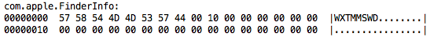

# Security settings
VBA can be used to distribute viruses, so users will not be able to run macros if their security settings are too restrictive. The default setting is to enable macros with notification, which means that users are warned every time a macro-enabled document or template is opened, and they need to actively choose to enable macros.

## Mac
If the checkbox next to **Word > Preferences... > Personal Settings > Security > Warn before opening a file that contains macros** is selected, users will be presented with a pop up saying “This document contains macros” before their files opens. They need to click “Enable Macros” or the macros won’t run.

## On a PC
With default settings, a message in a yellow bar at the top of the document appears, saying “Macros have been disabled”. Users must click **Enable Content** for macros to work.

Options can be set under **File > Options > Trust Center > Trust Center Settings > Macro Settings**. 


# Download errors
Check [error messages](error+messages), and also check logs in `MacmillanStyleTemplates/logs`.

# Mac won't load template in Startup
On OS X, because we download the template files from the internet, they are stripped of their filetype codes. This prevents Word from recognizing that the file is a template and causes Word to silently fail to load the Add-In. Additionally, Apple's `quarantine` XML attribute is added to the file. 

The following two Terminal commands will fix both issues (though change the path if needed).

```
$ xattr -d com.apple.quarantine /Applications/Microsoft\ Office\ 
  2011/Office/Startup/Word/GtUpdater.dotm
 ```
 
 ``` 
$ xattr -wx com.apple.FinderInfo "57 58 54 4D 4D 53 57 44 00 10 00 00 
  00 00 00 00 00 00 00 00 00 00 00 00 00 00 00 00 00 00 00 00" 
  /Applications/Microsoft\ Office\ 2011/Office/Startup/Word/GtUpdater.dotm
```

Verify that the `xattribute` is properly set with this command:

``` 
xattr -l /Applications/Microsoft\ Office\ 2011/Office/Startup/Word/GtUpdater.dotm
```

Results should look like:

