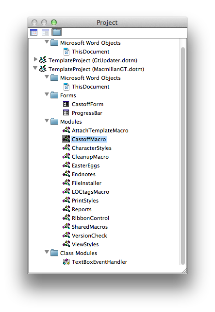

When a macro-enabled *document* (.docm) is opened, the user can run any of the macros it contains. When a macro-enabled *template* (.dotm) is loaded as an Add-In, it is considered a Global Template and the user can run its macros on any document. 

# Opening/closing template files
## Use File > Open only
To view the code in a template, open the template file using **File > Open** (not by double clicking the file - that opens a new document based on the template, not the template itself).

## Access the code
To access the code modules modules in a template, type Alt + F11 to open the Visual Basic Editor (VBE). Modules are shown in the Project window of the VBE.

To view a specific module, right-click on the module in the Project Window and select **View Code** from the menu.

## Always work on the local file
Because local version will be loaded automatically and can be confusing which you're interacting with. Use Export/Import Utilities to copy to repo.

## Saving template files
Don't save on a Mac--specifically `MacmillanGT.dotm` because it removed custom XML, but in general just to be safe. Instructions for how to export modules, commit and push, then pull to PC, Import all modules, then commit and push again.

Save all changes to MacmillanGT.dotm on a PC – NEVER save this template file on a Mac (or the Macmillan Tools tab/toolbar will be removed). If you are doing development on a Mac, export the modules with your changes, move those files to a PC (git push/pull is useful here), then import them into the template file on a PC. 

# Import / Export code  modules
Intro

To better manage this process, you can use the `Utilities.dotm` template in the repo. To use them, do the following:

1. Quit Word.
2. Copy the file `Utilities.dotm` from the local repo to your Word Startup directory.
3. Launch Word.
4. Use **File > Open** to open `Utilities.dotm` from the *Startup* directory (*not* from the git repo directly).
5. Open the VBE and view the `Utilities` code module.
6. Edit the location of your local Word-template repo for the constant `strRepoPath` at the top of the module.
7. Save the template file.

Now you should have two buttons added to the Quick Access Toolbar: a blue down arrow (ImportAllMacros) and a blue up arrow (ExportAllMacros). Clicking the buttons will launch the macros.

If you get an error when you try to run the macros, go to *File > Options > Trust Center > Macro Settings*  and check "Trust access to the VBA project object model."

Note this hasn't been tested in Mac, just PC (though if anyone wants to test on Mac and update the code, please do!)

Something about how it might delete all your code so export and commit often.

## ExportAllModules macro
What it does in detail and issues it has. Probably will remove userform export (definitely for binaries)

### Export modules manually
To export an individual module without using this macro:

1. In the Projects Window, right-click or Cmd + click on the module you'd like to export.
1.  From the list that opens, select Export File...
1. Navigate to the correct subdirectory of your local git repo.
1. Click Save.
1. If prompted that the file already exists, choose to replace the old version of the file.

Standard modules export as Basic (.bas) files, class modules export as Class (.cls) files, and forms export as two different files: a .frm file that contains the code for that object and a binary .frx file that contains the userform object itself. Except for the .frx binary file, these exported files can be tracked in Git, so you can now add the modified file and commit the change.

## ImportAllModules macro
ImportAllModules removes clears all the code in all open templates and then imports 

1. all of the modules in each template's repo subdirectory, and 
1. all of the modules in SharedModules. 

This is particularly useful for merge conflicts with template files.

#### Import modules manually
To import an individual module without using this macro:

1. In the Projects window, right-click or cmd + click on the module you'd like to import (if it already exists).
1. Select Remove ModuleName from the menu.
1. When prompted "Do you want to export ModuleName before removing it?" select No.
1. Back in the Projects window, right-click or cmd + click on the template project name.
1. From the list that opens, select Import File...
1. Navigate to the correct subdirectory of your local git repo and select the module you want to import.
1. Click Open.

Note the ThisDocument class module is a permanent feature in each template and cannot be deleted or have its name changed. Thus if you need to update one of these modules from an external class file, it is easiest to open the TheDocument.cls file in a text editor and then copy and paste the code into the ThisDocument module. If you try to import it using the instructions above you'll get a duplicate module.

# Userforms
UserForms appear in the template as a single module, but when exported two files are created: `ProgressBar.frm` is a class module that contains properties and methods for this class, while `ProgressBar.frx` is a binary file containing the design of the Userform itself. You only need to select the .frm file to import, but both must be present in the same directory.

Viewing code and viewing object

# ThisDocument.cls modules
Special class module, required for each template, can't be deleted entirely.

## AutoExec and Document_Open procedures
Must be in `ThisDocument.cls` module, which incidentally can't be removed, because it's the object for the template file itself.

